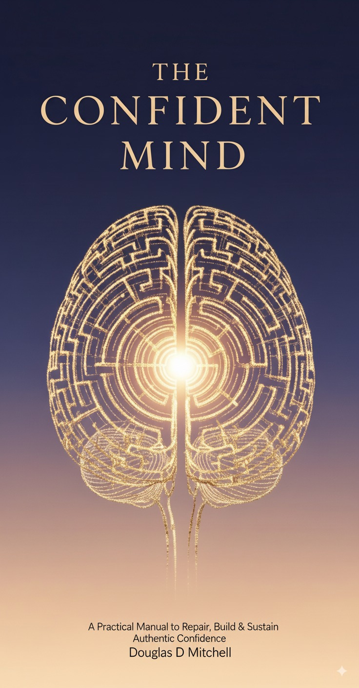

  

# The Confident Mind by Douglas Mitchell— Reader Bonus

Landing page and QR codes for the bonus audio/video included with **The Confident Mind**.

---

## 📖 Buy the Book

- **Amazon:** [https://www.amazon.com/s?k=The+Confident+Mind+Douglas+Mitchell](https://a.co/d/e2jlJoP)

---

## ✅ Public Pages

- **Landing page (cover only):**  
  https://senpai-sama7.github.io/The-Confident-Mind---BONUS/

- **QR code page (render + download PNGs):**  
  https://senpai-sama7.github.io/The-Confident-Mind---BONUS/qr.html

---

## 🎧/🎬 Direct Media Links

> GitHub Pages is case-sensitive. Use exact filenames.

- **Audio (.m4a):**  
  https://senpai-sama7.github.io/The-Confident-Mind---BONUS/assets/the-confident-mind-audio.m4a
- **Audio (.mp3 mirror, if present for legacy QR):**  
  https://senpai-sama7.github.io/The-Confident-Mind---BONUS/assets/the-confident-mind-audio.mp3
- **Video (.mp4):**  
  https://senpai-sama7.github.io/The-Confident-Mind---BONUS/assets/the-confident-mind-video.mp4

---

## 🧾 QR Images (PNG)

Ready for KDP interiors:

- **Audio QR PNG:**  
  https://senpai-sama7.github.io/The-Confident-Mind---BONUS/assets/the-confident-mind-audio-qr.png
- **Video QR PNG:**  
  https://senpai-sama7.github.io/The-Confident-Mind---BONUS/assets/the-confident-mind-video-qr.png

Or generate via the **QR page** above.

---

## 🔧 Repo Structure

The-Confident-Mind---BONUS/
├─ index.html # landing page (cover only)
├─ qr.html # QR render + download
└─ assets/
├─ cover.jpg|cover.jpeg
├─ the-confident-mind-audio.m4a # primary audio
├─ the-confident-mind-audio.mp3 # optional MP3 mirror (for legacy QR)
├─ the-confident-mind-video.mp4
├─ the-confident-mind-audio-qr.png # QR PNGs for KDP
└─ the-confident-mind-video-qr.png

---

## ✅ Publishing Notes

- Repo must be **public**.  
- **Settings → Pages → Deploy from branch →** `main` **/** root.  
- Do **not** use Git LFS for media; Pages won’t serve LFS pointers.  
- Keep each file **≤ 100 MB**.

---

## ❓Troubleshooting

- **404 on media:** filename or path mismatch. Match the printed QR URL exactly.
- **QR opens but won’t download on iOS:** provide an `.mp3` mirror and/or a `.zip`.
- **Cover not visible:** `cover.jpg` vs `cover.jpeg` case/extension mismatch.

---
